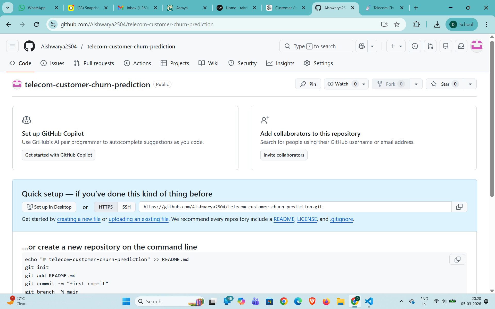

# 📡 Telecom Customer Churn Prediction

This project predicts whether a telecom customer is likely to churn using machine learning techniques and an interactive Streamlit dashboard.

---

## 📊 Project Overview

Customer churn is a major challenge for telecom companies. By analyzing customer usage patterns and service information, machine learning models can identify customers who are likely to leave the service.

This project builds a predictive model using the **Random Forest algorithm** and provides an interactive **Streamlit dashboard** where users can simulate customer data and view churn predictions.

---

## ✨ Features

- Data preprocessing and feature engineering
- Exploratory data analysis (EDA)
- Logistic Regression and Random Forest models
- Model performance evaluation
- Feature importance analysis
- Interactive Streamlit dashboard for real-time churn prediction

---

## 🛠 Technologies Used

- Python
- Pandas
- Scikit-learn
- Streamlit
- Matplotlib
- Git
- GitHub

---

## 🚀 How to Run the Project

Clone the repository:

```bash
git clone https://github.com/Aishwarya2504/telecom-customer-churn-prediction.git

## 📸 Dashboard Preview

